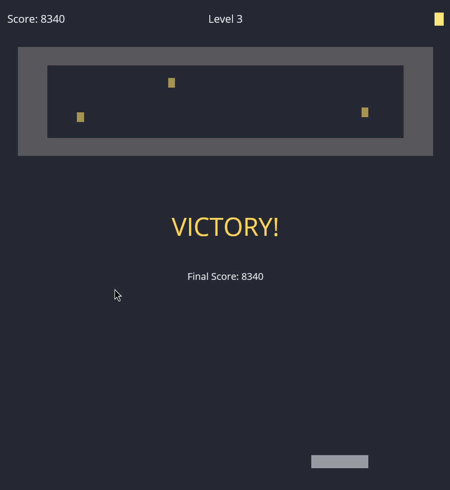
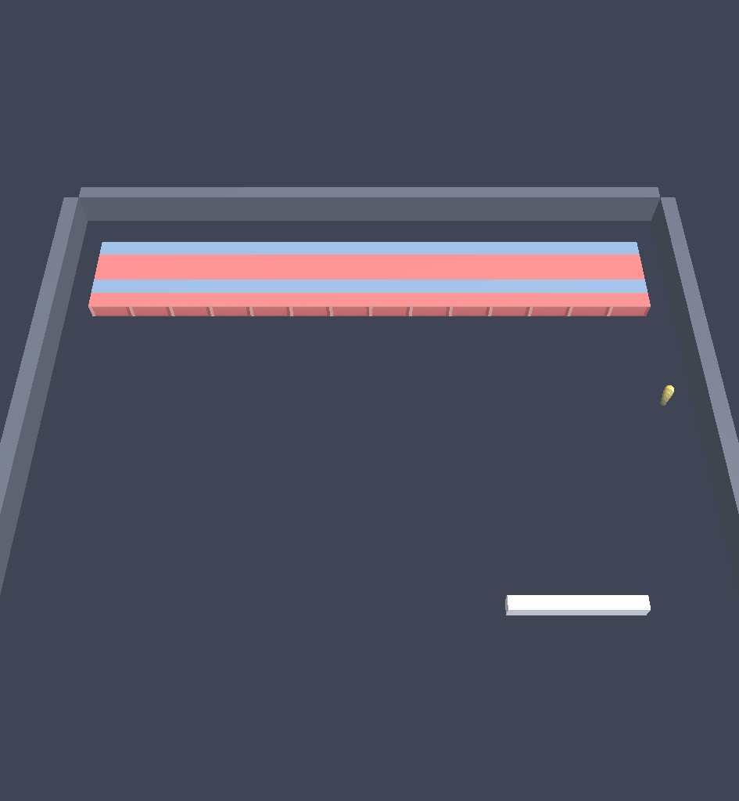

# arkanoid

A single-player Arkanoid/Breakout clone in Rust, rendered natively with
`wgpu`. See [`docs/spec.md`](docs/spec.md) for the full design contract.



## Running

```bash
cargo run --release
```

No assets or setup required — it builds and launches straight from a fresh
clone.

### 3D renderer (experimental)

An alternate perspective-camera renderer (`src/render3d/`) draws the same
simulation as cubes and a sphere instead of flat quads. It's opt-in behind a
flag until the presentation-3d epic is done, and never changes gameplay —
`src/game.rs`'s physics are identical either way (see the deterministic-replay
test in `game.rs`, pinned to the same hash in both renderers):

```bash
cargo run --release -- --renderer 3d
```



## Controls

| Key                | Action                  |
|---------------------|--------------------------|
| Left / Right, A / D | Move the paddle          |
| Space               | Launch the ball          |
| Escape (or P)       | Pause / resume           |

Keyboard only; menu and pause screens show the same key hints on-screen.

## Fixed-timestep design

The simulation runs on its own fixed 120 Hz clock (`src/game.rs`'s
`Game::tick`), completely decoupled from the display's refresh rate and from
`wgpu`'s vsync-driven present loop: each real frame, the main loop advances
the simulation by as many 120 Hz ticks as have elapsed (substepping further
within a tick when needed to prevent the ball tunneling through bricks at top
speed), then hands the renderer the previous and current simulation states
along with a leftover fractional-tick `alpha` so `src/render.rs` can linearly
interpolate positions between them — this keeps motion smooth at any monitor
Hz without ever changing gameplay physics, which only ever see fixed
120 Hz steps.

